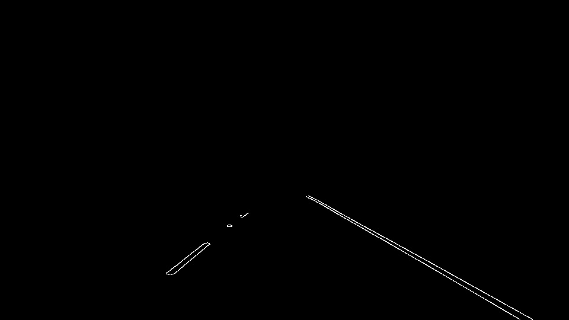
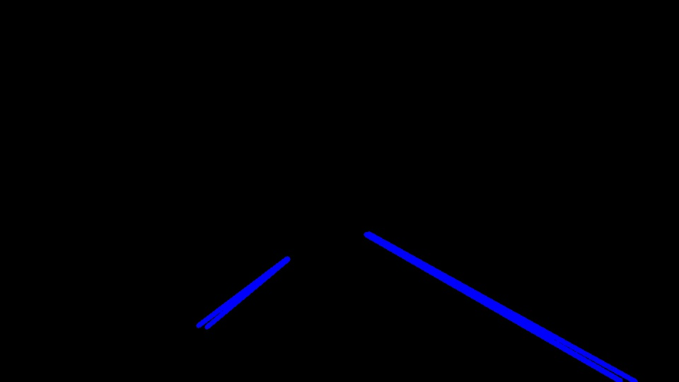
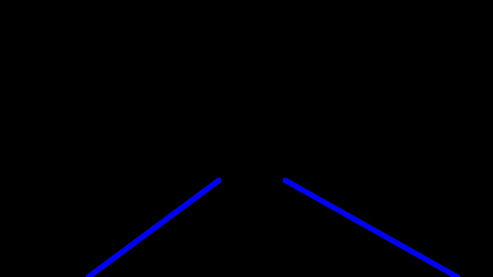
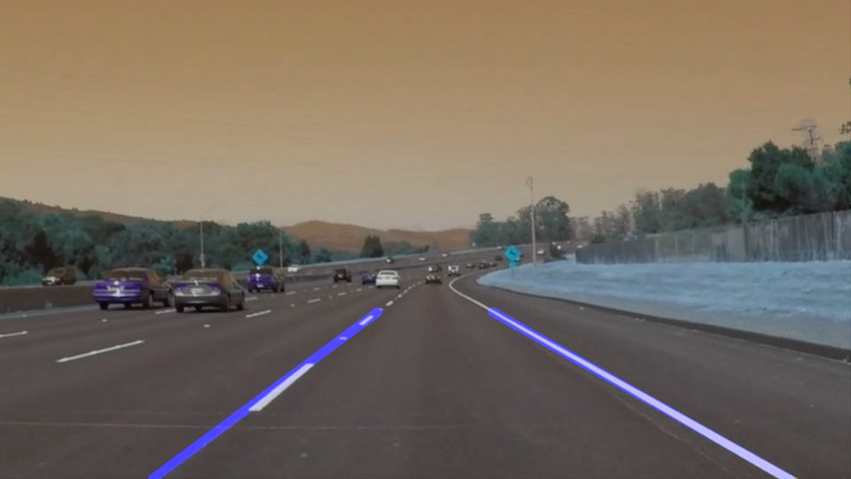

# **Finding Lane Lines on the Road** 

## Over view

In the process of modelling `self driving cars`, we built the intelligence to the cars for making decisions. The first step is to detect and define the safe area to drive.

Humans differentiate the lane lines by vision. Camera acts as eye of computer. By processing the video output from camera, cars can be designed to determine the lane lines.

---

### **Finding Lane Lines on the Road**

Video is collection of frames. So, we are preparing code for single frame or image. Later, by iterating for all frames the result video is created. There are **`Five`** steps in finding lane lines.
1. Convert imgae to gray scale
2. Apply canny edge detection 
3. Masking area other than ROI (Region Of Interest)
4. Apply hough transform
5. Extra-polation of hough lines

Input image: 
---
</img>

1. Convert image to gray scale
---
Lane lines can be white/Yellow & color often changes with the lighting conditions and weather. So, we can't rely on color. 
We are converting RGB image to Gray
```python
imgGray=cv2.cvtColor(img,cv2.COLOR_RGB2GRAY)
plt.imshow(imgGray, cmap='gray')
```
</img>

2. Apply canny edge detection
---
From the gray scale image, we are detecting the outline of the objects present in the input image. For better edge detection, we are fixing the threshold in `1:3` ratio
```python
imgEdge=cv2.Canny(imgBlur,50,150)
plt.imshow(imgEdge,cmap='gray')
```
</img>

3. Masking area other than ROI (Region Of Interest)
---
Since the road is present in lower half of the input, the remaining parts are masked(black color). In this approach, triangle mask is used. 
```python
max_R,max_C=edgeImg.shape
left_bottom=[0,max_R]
right_bottom=[max_C,max_R]
apex=[max_C//2,int(max_R*0.55)]
maskImg=region_of_interest(edgeImg,np.array([left_bottom,right_bottom,apex]))
```
</img>

4. Apply hough transform
---
This is used to find the specific shape in the input image(output of masked canny edge detection)
```python
rho=1
theta=np.pi/180
threshold=50
## Since we applied mask, maximum possible & acceptable length will be 60 percent of total length
## max_len=max_R*0.6
min_len=((max_R*0.6)*0.25)//1       ## line should be greater than 25 % of max_len
max_gap=(((max_R*0.6)*0.25)*0.5)//1 ## line gap should not exceed 50 % of min_len
lines=cv2.HoughLinesP(maskImg,rho,theta,threshold,np.array([]),min_len,max_gap)
```
</img>

5. Extra-polation of hough lines
---
The lines resulted as the output of Hough transform are extra-polated using the following approach. 
* lines parallel to `X axis` or `Y axis` (more or less) are ignored
* from selected lines in left side, collectively slope`m`, intersection`c` calculated (first order equation, i.e., straight line). The same repeated for right side line
* Extra-polation to be done from lower end of picture to middle of picture

```python
    for line in lines:
        for x1,y1,x2,y2 in line:
            slope=np.float32((y2-y1)/(x2-x1))
            #print(slope)
            if slope>=min_R_slope and slope<=max_R_slope:
                RX.append(x1)
                RX.append(x2)
                RY.append(y1)
                RY.append(y2)
            elif slope<=min_L_slope and slope>=max_L_slope:
                LX.append(x1)
                LX.append(x2)
                LY.append(y1)
                LY.append(y2)
    
    lowY,highY=maxR,int(maxR*0.65)
    
    if len(LX)>=2 :
        LM,LC=np.polyfit(LX,LY,1)       
        Leftlx=int((lowY-LC)/LM)
        Lefthx=int((highY-LC)/LM)
        cv2.line(img, (Leftlx,lowY), (Lefthx,highY), color, thickness)
    
    if len(RX)>=2:
        RM,RC=np.polyfit(RX,RY,1)
        rightlx=int((lowY-RC)/RM)
        righthx=int((highY-RC)/RM)
        cv2.line(img, (rightlx,lowY), (righthx,highY), color, thickness)
```
</img>


## Output Image
Finally, the result image is super imposed on input image.

</img>

## Areas of improvements
+ In the current process, gray scale image is taken for canny edge detection. This produce poor results while the light intensity changes suddenly. example: shadows, open high way to tunnel transition
> __Suggestion :__ HSL conversion may improve the results 
+ The boundary lines are calculated as straight lines, there can be curve lines. Sharpe curves present in hill roads.
> __Suggestion :__ Higher order polynomial would solve this issue (Second order equations are best suitable for our scenario)
+ Cars expected to run on roads without lane markings and in some roads lane line markings are not possible. Roads on desserts are best example
> __Suggestion :__ The output only relay on input image, with help of other sensors to find the depth of objects arround the vehicle. 
